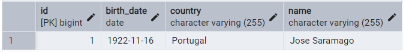
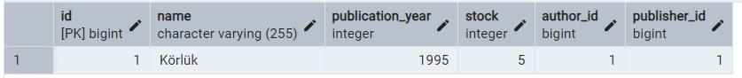
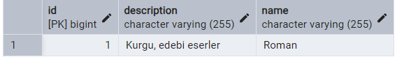
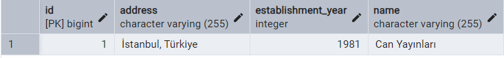
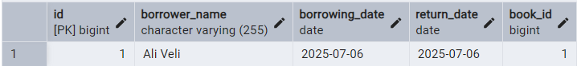
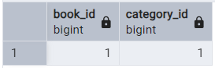

# Library Management System

Bu proje, Spring Boot ve PostgreSQL kullanılarak geliştirilmiş basit bir Kütüphane Yönetim Sistemidir.

## Kullanılan Teknolojiler

- Java 21
- Spring Boot 3.3.13
- Spring Data JPA
- PostgreSQL
- Lombok
- Maven

## Varlıklar (Entity Sınıfları)

- **Book**: Kitap bilgilerini tutar.
- **Author**: Yazar bilgileri.
- **Publisher**: Yayın evi bilgileri.
- **Category**: Kitap kategorileri.
- **BookBorrowing**: Kitap ödünç alma kayıtları.

## Varlıklar Arası İlişkiler

- One-to-Many: Book → Author
- One-to-Many: Book → Publisher
- One-to-Many: Book → BookBorrowing
- Many-to-Many: Book ↔ Category

## API Uç Noktaları (örnekler)

| Method | Endpoint               | Açıklama               |
|--------|------------------------|------------------------|
| GET    | /api/books             | Tüm kitapları getirir |
| POST   | /api/books             | Yeni kitap ekler      |
| GET    | /api/authors           | Tüm yazarları getirir |
| POST   | /api/borrowings        | Kitap ödünç al        |
| PUT    | /api/borrowings/{id}/return | Kitabı iade et   |

## Veritabanı Tabloları (PgAdmin Görselleri)

Aşağıda sistem tarafından otomatik oluşturulan tabloların ekran görüntüleri yer almaktadır:

1. `authors`  

2. `books`  

3. `categories`  

4. `publishers`  

5. `book_borrowings`  

6. `book_category` (bağlantı tablosu)  

